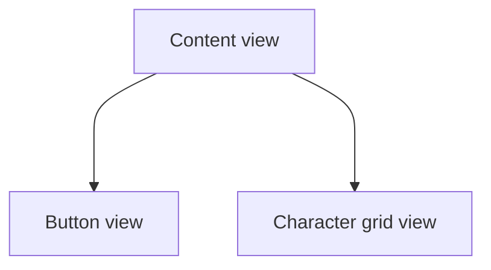

# DisneyCharacter
## 🧀 프로젝트 요약
* API호출, 비동기 작업을 학습하기 위한 SwiftUI 앱
* 디즈니 캐릭터를 검색하여 출연한 작품 정보를 확인하는 기능

## 🧀 실행 화면
<p align="center">
  
</p>

## 🧀 개선한 부분
**변경하고 싶었던 부분**
- Network작업하는 객체가 페이지 정보를 가짐 (pageNum: Int)
- CharacterGridView가 ButtonView를 포함하는 구조
- CharacterGridView가 캐릭터 데이터를 프라퍼티로 가지고 ButtonView에서 바인딩해서 업데이트 하는 구조

**변경한 부분**
- Network 객체는 페이지 번호를 받아서 데이터를 주는 형태로 수정
  - 페이지에 대한 정보는 뷰가 알도록 수정
- CharacterGridView와 ButtonView를 분리
- ContentView가 캐릭터 데이터를 가지고 뷰가 전달받도록 수정
  - CharacterGridView, ButtonView는 Binding을 통해 데이터를 참조해서 뷰를 업데이트
  - ButtonView에서 Previous, Next, 검색 버튼을 통해 프라퍼티에 저장된 데이터를 수정

## 🧀 개선 결과


```swift
final class DisneyNetwork: ObservableObject {
    private let baseUrlString: String = "https://api.disneyapi.dev/character"
    @Published var isSearchingInProgress: Bool = false
    
    func getDisneyData(pageNum: Int) async throws -> [DisneyDataInfo] {
        let url = URL(string: "\(baseUrlString)?page=\(pageNum)")!
        let data = try await URLSession.shared.data(from: url)
        let result = try JSONDecoder().decode(DisneyData.self, from: data.0).data
        
        return result
    }
    
    func searchCharacter(name: String) async throws -> [DisneyDataInfo] {
        let query = [URLQueryItem(name: "name", value: "\(name)")]
        var urlComponents = URLComponents(string: baseUrlString)
        urlComponents?.queryItems = query
        let url = urlComponents!.url!
        
        let data = try await URLSession.shared.data(from: url)
        let result = try JSONDecoder().decode(DisneyData.self, from: data.0).data
        
        return result
    }
}
```

**결과 요약**
* `pageNum`을 뷰가 가짐으로써 네트워크와 뷰의 책임이 더 잘 분리됨.  
* `CharacterGridView`와 `ButtonView`를 구분함으로써 보다 직관적으로 관리할 수 있게 함.

## 🧀 API 주소
https://disneyapi.dev  
